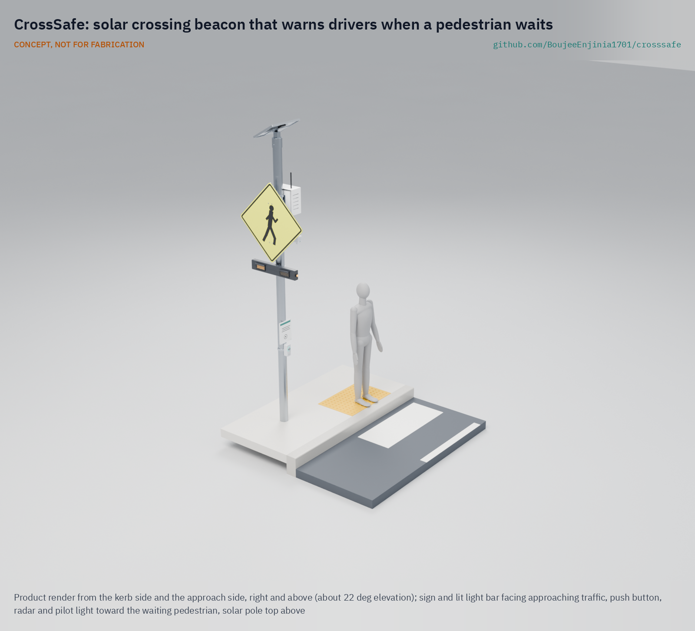
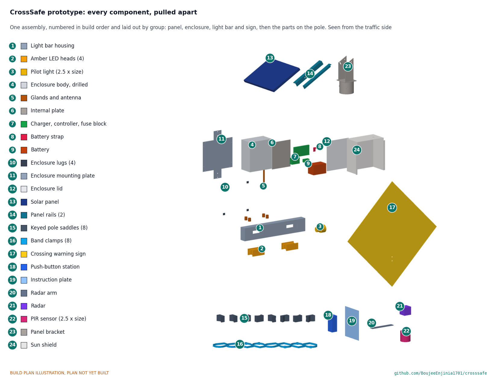

# CrossSafe

     

**Area:** Smart Cities · **TRL:** 3 of 9 (proof of concept on paper) · **Value-engineering target:** $350 USD (one assembly on an existing pole) · **Difficulty:** 3 of 5

A solar crossing beacon that detects a waiting pedestrian and flashes high-visibility lights to warn drivers at unsignalized crossings near schools and markets.

[Exploded render](media/render-exploded.png) · [Detail render](media/render-detail.png) · [Interactive 3D model](media/viewer.html) · [Concept blueprint (PDF)](media/concept-blueprint.pdf) · [General arrangement CRS-DWG-001 (PDF)](cad/drawings/CRS-DWG-001.pdf) · [Calculations](docs/04-calcs/01-sizing.md) · [Prototype build plan](docs/05-build-plan.md) · [Design decisions](docs/06-design-decisions.md) · [Review note](docs/REVIEW.md)

## Concept rationale

A driver yields when they see someone waiting, and a warning that appears only then is hard to ignore. CrossSafe copies the logic of the rectangular rapid flashing beacon (RRFB): two amber lights under the crossing sign that flash in a wig-wag pattern only when a pedestrian presses a button or a small radar, woken by a motion sensor, sees someone waiting at the kerb. One assembly stands on each side of the road; each has its own 20 W panel and LiFePO4 battery, and the two stay in step over a short radio link, so there is no mains connection and no cable across the road.

It is open and garage-buildable because the crossings that need it most are the ones no one will pay a signal contractor to fix. Every part is a standard sign, LED module, small solar kit, battery, IP65 box or common microcontroller, the firmware and wiring are published, and a local technician can repair it with hand tools. An open reference also lets road authorities, schools and researchers see exactly what the device does before they ask for approval to install it.

## Burning platform

About 1.19 million people die on the world's roads each year, and pedestrian deaths rose to about 274,000 in 2021, 23 % of the total, with nine in ten road deaths in low- and middle-income countries ([WHO, 2023](https://www.who.int/news/item/13-12-2023-despite-notable-progress-road-safety-remains-urgent-global-issue)). The UN General Assembly's target is to halve road deaths and injuries by 2030 ([WHO fact sheet](https://www.who.int/news-room/fact-sheets/detail/road-traffic-injuries)), and progress on pedestrians has gone the wrong way.

The problem is concentrated away from signals and after dark. In the United States, 74 % of the 7,314 pedestrians killed in 2023 died at locations that were not intersections, and 77 % died in the dark ([NHTSA, 2025](https://crashstats.nhtsa.dot.gov/Api/Public/ViewPublication/813727)). Pedestrian-activated beacons are one of the few low-cost measures with strong evidence: FHWA reports RRFBs can cut pedestrian crashes by up to 47 % and raise driver yielding to as high as 98 % ([FHWA](https://highways.dot.gov/safety/proven-safety-countermeasures/rectangular-rapid-flashing-beacons-rrfb)).

## Where it could be used

### By industry

| Industry | Use |
| --- | --- |
| Municipal roads and public works | Mid-block and uncontrolled crossings that do not qualify for a full signal |
| Education | School crossings used at the start and end of the day, often by children crossing alone |
| Markets and retail districts | Busy crossings on market days where traffic and pedestrian peaks coincide |
| Public transport | Crossings to bus and minibus stops on arterial roads |
| Hospitals, universities and campuses | Internal roads crossing between car parks, wards and buildings |
| Industrial sites and ports | Pedestrian crossings on plant roads shared with trucks and forklifts, off the public road network |

### By country or region

| Country or region | Why it matters there |
| --- | --- |
| Sub-Saharan Africa | The WHO African Region has 19 % of global road deaths with 15 % of the population and 3 % of the world's vehicles ([WHO Africa](https://www.afro.who.int/health-topics/road-safety)); walking is the main way many people travel and crossings rarely have signals |
| India | India accounts for about 10 % of road crash deaths worldwide, and most who die are pedestrians, cyclists and motorcyclists ([WHO India](https://www.who.int/india/health-topics/road-safety)) |
| South-East Asia | The WHO South-East Asia Region has the largest share of global road deaths, 28 % ([WHO, 2023](https://www.who.int/news/item/13-12-2023-despite-notable-progress-road-safety-remains-urgent-global-issue)) |
| Latin America and the Caribbean | About 145,090 road deaths in the Americas in 2021, with pedestrians, cyclists and motorcyclists rising from 39 % to 47 % of deaths since 2009 ([PAHO](https://www.paho.org/en/topics/road-safety)) |
| United States | 7,314 pedestrians killed in 2023, 74 % away from intersections ([NHTSA](https://crashstats.nhtsa.dot.gov/Api/Public/ViewPublication/813727)); RRFBs already have an FHWA interim approval ([IA-21](https://mutcd.fhwa.dot.gov/resources/interim_approval/ia21/index.htm)), so an open design could serve small towns and schools on tight budgets |
| United Kingdom | Pedestrians were 25 % of the 1,624 road deaths in Great Britain in 2023 ([Department for Transport](https://www.gov.uk/government/statistics/reported-road-casualties-great-britain-annual-report-2023/reported-road-casualties-great-britain-annual-report-2023)); local rules differ from US practice, so the flash pattern and sign are configurable |

## What sparked the idea

The starting point was a lapse in the rulebook. On December 21, 2017, FHWA terminated Interim Approval 11, which had allowed US agencies to install rectangular rapid flashing beacons, because the device had been patented and patented traffic control devices cannot be included in the MUTCD. The patents were then expressly abandoned, the RRFB concept passed into the public domain, and FHWA reinstated the device as Interim Approval 21 on March 20, 2018 ([FHWA IA-21](https://mutcd.fhwa.dot.gov/resources/interim_approval/ia21/index.htm)). A proven safety device had been off the list for three months over who owned it, and it came back only once it belonged to no one. CrossSafe takes that at its word: a beacon to the IA-21 pattern whose drawings, parts list and firmware are published so that any town, school or workshop can build and repair it.

## Problem

Pedestrians die at unsignalized crossings, and full traffic signals are costly and slow to approve. Static signs fade into the background, beacons that flash all day are ignored, and many crossings have no mains power nearby.

Full problem statement: [docs/01-problem.md](docs/01-problem.md)

## Concept

A solar crossing beacon that detects a waiting pedestrian and flashes high-visibility lights to warn drivers at unsignalized crossings near schools and markets.

One assembly stands on each side of the road: a crossing warning sign with a double-sided amber light bar and a pedestrian pilot light, a push button, a presence radar woken by a PIR sensor, and a pole-top enclosure with the battery, charger and controller under a ventilated sun shield and a 20 W panel. Both sides flash together for about 13 s per activation on a 7 m road. Only activation counts and faults are logged; no images or audio are recorded.

TRL 3 calculations ([CRS-CAL-001](docs/04-calcs/01-sizing.md)): 16.0 Wh/day at 300 activations, 7.7 days without sun, energy neutral at 1.05 peak sun hours, a 114.3 mm post at 45 % of yield in a 40 m/s gust, 53.9 °C inside the sun-shielded enclosure at 50 °C ambient, and $360 in parts per assembly on an existing pole ($720 per crossing), $10 over the $350 value-engineering target after the parts that make the design buildable. Sign rotation on existing poles under about 70 mm is still at risk. Design decisions are recorded in [CRS-DDR-001](docs/decisions/0001-trl2-review-decisions.md), [CRS-DDR-002](docs/decisions/0002-recommendations-accepted.md) and [CRS-DDR-003](docs/decisions/0003-design-for-construction.md), and open ones, with the cost drivers, in the [design decisions register](docs/06-design-decisions.md). See the [design precis](docs/02-concept.md), [requirements](docs/03-requirements.md) and [general arrangement](cad/drawings/CRS-DWG-001.pdf).

## Key components

- Crossing warning sign, 750 mm, with a double-sided amber LED light bar (two heads per face)
- Accessible push button, a pedestrian pilot light, and a 24 GHz presence radar (presence only) switched on by a PIR sensor
- 20 W solar panel, MPPT charger and 12.8 V 12 Ah LiFePO4 battery
- Controller on the FieldNode radio core, with LED drivers and a LoRa link that keeps both sides in step
- IP65 pole-top enclosure under a ventilated sun shield
- Eight identical keyed pole saddles with stainless bands for an existing pole of 76 mm or larger (smaller poles wait for a slip-torque test of the saddle's grip), or a 114.3 mm post with an anti-rotation bolt where none exists

The working bill of materials is in [bom/bom.csv](bom/bom.csv).

## Building the prototype

The [prototype build plan](docs/05-build-plan.md) (CRS-BLD-001) shows how to make and fit every component of one assembly, the existing-pole kit, on a 3.7 m test post, with a making sketch for each made part, close-ups of the joints and a picture for every assembly step. Every part on the pole is held the same way: an aluminium saddle with a keyed V sits on the pole, a stainless band runs round the pole and across the saddle's front, and the part bolts to the saddle over the band. The work is sawing, drilling, tapping and folding aluminium bar and sheet, one small steel weldment, and wiring bought modules. It is a plan, not yet built; building to it is TRL 4 work.

## Safety

> A research prototype; traffic control devices must meet local standards and road authority approval before use on a public road. Pedestrians must still check that drivers have stopped. Lithium cells can overheat, vent and burn. Use protected cells or LiFePO4, fuse every pack, charge only within the cell maker's limits and never leave a first build charging unattended. Street furniture and pole mounts must be installed only with the asset owner's permission, by trained crews, with fall protection and traffic management as local rules require. The post, clamps, footing or host pole must pass a wind load check by a qualified engineer before installation; sign and panel edges are sharp.

## Repository layout

| Folder | Contents |
| --- | --- |
| `docs/` | Problem, concept, requirements, calculations and design decisions |
| `cad/src/` | build123d Python source, the source of truth for all geometry |
| `cad/step/`, `cad/stl/` | Exported models for FreeCAD, other CAD tools and printing |
| `cad/drawings/` | 2D sketches and dimensioned drawings |
| `bom/` | Bill of materials |
| `electronics/` | KiCad schematics and PCB layouts |
| `firmware/` | Microcontroller code |
| `media/` | Renders, perspectives and photos |
| `build-log/` | Dated prototyping notes |

## Documentation

Controlled documents follow the portfolio [documentation standard](.kit/STANDARDS.md). Each carries a document ID (CRS-PRC-001 for the precis), a version and a revision history. Branded PDFs are built with `python .kit/render.py` and attached to GitHub Releases when a document is tagged, for example `CRS-PRC-001/v1.0`.

## Credits

Designed by Amish Chadha. See [CONTRIBUTORS.md](CONTRIBUTORS.md) for roles. To cite this design, use [CITATION.cff](CITATION.cff) (GitHub shows it as "Cite this repository").

AI assistance (Claude) was used to accelerate concept renders, prototype documentation and first-pass sizing calculations. Design direction and all decisions are Amish Chadha's, recorded in this repository's decision records (`docs/decisions/`).

## Licenses

- **Hardware** (CAD, drawings, BOM, electronics): [CERN-OHL-S v2](LICENSE)
- **Software** (firmware, scripts, notebooks): [MIT](LICENSE-SOFTWARE)

A project of the [Design Molecule](https://designmolecule.com) lab.
