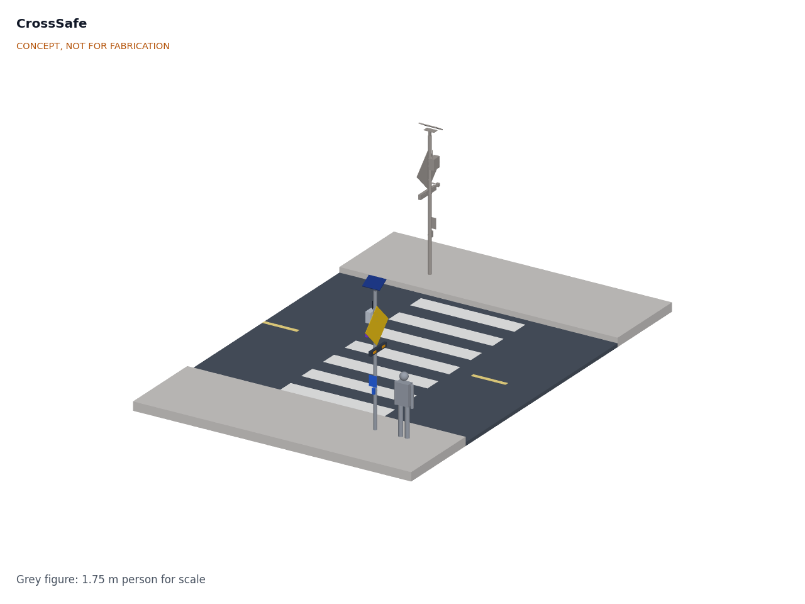
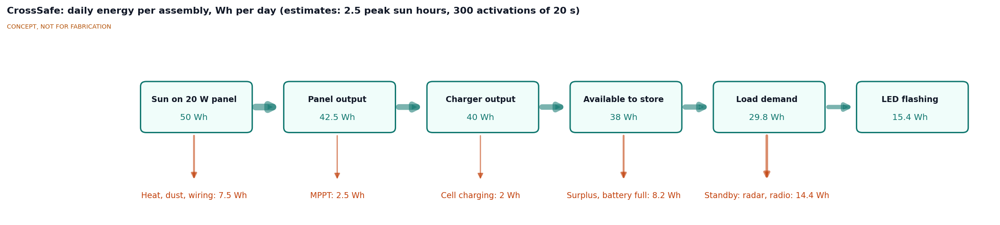
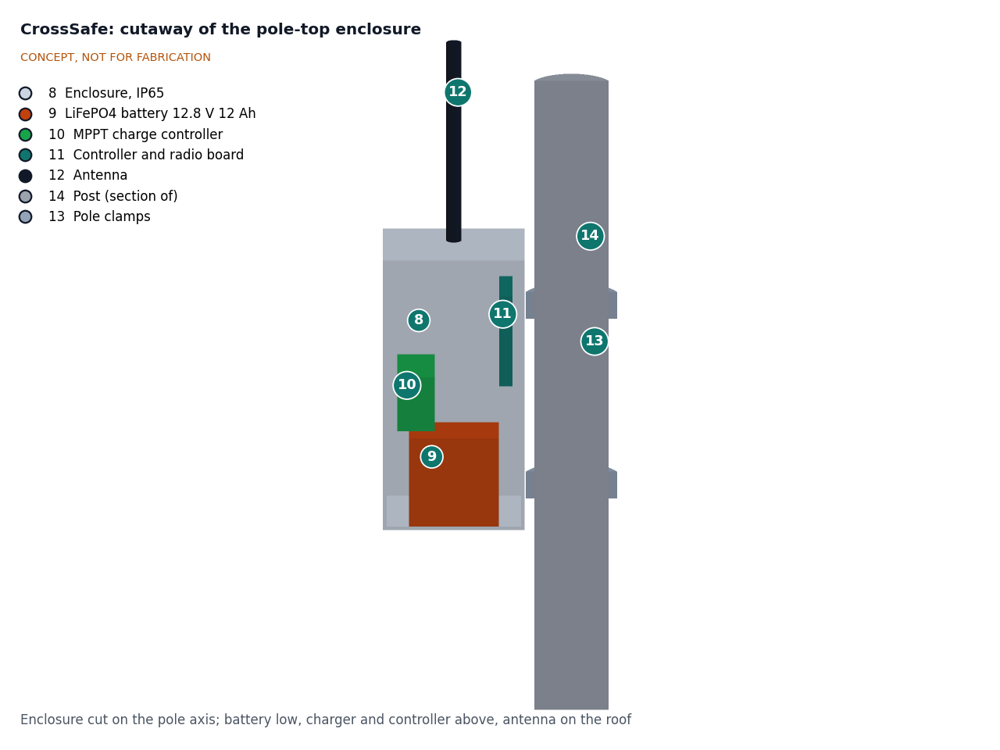

# CrossSafe design precis

## Summary

CrossSafe is a pair of pole-mounted, solar-powered warning beacons, one on each side of an unsignalized crossing. When a pedestrian presses the button or a small radar sensor sees someone waiting at the kerb, both assemblies flash two amber lights under the crossing warning sign for about 13 s, and a pedestrian-facing light confirms the warning is on. Each assembly runs from a 20 W panel and a 12.8 V 12 Ah LiFePO4 battery, and the two sides stay in step over a short-range radio link, so no trench or cable across the road is needed. First-order estimates give about 30 Wh/day of use at 300 activations, about 4.1 days without sun, and about $361 in parts per assembly. All figures are TRL 2 estimates to be checked at TRL 3.

The concept follows the rectangular rapid flashing beacon (RRFB), which FHWA lists as a proven safety countermeasure ([FHWA](https://highways.dot.gov/safety/proven-safety-countermeasures/rectangular-rapid-flashing-beacons-rrfb)), and uses the US Interim Approval IA-21 as its reference for light size and flash pattern ([FHWA IA-21](https://mutcd.fhwa.dot.gov/resources/interim_approval/ia21/index.htm)). It is an open reference design, not a certified traffic control device.

## How it works

1. **Idle.** The controller sleeps, the radar watches a waiting zone of about 1.5 x 2 m at the kerb, and the button is armed. The battery charges from the panel.
2. **Trigger.** A button press, or a person detected in the waiting zone for 1 s or more, wakes the controller.
3. **Synchronize.** The controller sends a short LoRa packet to the far-side assembly (and listens for the same from it). Both start flashing within about 0.1 s (estimate).
4. **Warn.** Two amber heads per face flash in a wig-wag pattern at 75 sequences per minute for the site's set time (crossing length / 0.9 m/s + 5 s, about 13 s for 7 m). A new trigger extends the time. The back faces confirm to the pedestrian that the warning is on, and the button gives a click and a tactile pulse.
5. **Log.** The controller counts activations and records faults and battery state. It stores no images or audio; the radar reports presence only.

Figure 2 shows the daily energy flow and Figure 3 the parts.

## Main components

Table 1. Components of one assembly. Numbers match the exploded view and `bom/bom.csv`.

| No. | Component | Concept choice |
| --- | --- | --- |
| 1 | Crossing warning sign | 750 mm diamond, retroreflective, local sign design |
| 2 | Light bar housing | Folded aluminium, double sided, 720 x 130 x 70 mm, bottom at 2.1 m |
| 3 | LED heads (4) | Amber, 127 x 51 mm minimum, two per face, with daylight and night levels |
| 4 | Push-button station | Vandal-resistant piezo button with acknowledgement tone and tactile arrow, instruction plate, at about 1.0 m |
| 5 | Presence radar | 24 GHz presence sensor on a short arm at about 2.45 m, aimed at the waiting zone |
| 6 | Solar panel | 20 W monocrystalline, about 500 x 360 mm, tilted about 30 degrees toward the equator |
| 7 | Panel bracket | Steel top bracket on the post cap |
| 8 | Enclosure | IP65 polycarbonate, 260 x 300 x 150 mm, membrane vent, cable glands, at about 2.85 to 3.15 m |
| 9 | Battery | LiFePO4 12.8 V 12 Ah (about 154 Wh) with internal BMS |
| 10 | Charge controller | Small MPPT controller with a LiFePO4 profile and low-temperature charge cut-off |
| 11 | Controller and radio board | Microcontroller, LED drivers, LoRa radio for side-to-side sync, real-time clock, fault indicator |
| 12 | Antenna | Short whip on the enclosure roof |
| 13 | Pole clamps | Stainless band clamps with brackets |
| 14 | Post | 89 x 4 mm galvanized steel, 3.7 m above the sidewalk, or an existing pole |

## Key design choices

Each choice below is proposed, awaiting Amish (see `docs/REVIEW.md`).

- **RRFB-style amber beacons, not a signal.** Amber warning lights with the standard sign ask drivers to yield; they do not claim to stop traffic, which keeps the device in a simpler approval class in most places.
- **Button plus passive detection.** The button is the reliable, accessible trigger; radar catches people who do not press it. The radar reports presence only, which keeps images and audio off the device.
- **Radio sync instead of a cable.** A LoRa point-to-point link avoids cutting the road. If the link drops, each side still flashes on its own trigger and reports a fault.
- **Own 12 V power system.** The LED load (up to about 24 W for four heads) is far beyond the FieldNode power stage (6 W panel, 3.2 V cell), so CrossSafe uses a 12.8 V LiFePO4 battery with a built-in BMS. FieldNode's radio and logging design can be reused for the controller (proposed, awaiting Amish). CellGuard, the lab's open BMS for 4 to 16 LiFePO4 cells, is a later option in place of the drop-in battery's closed BMS.
- **Electronics high on the pole.** The enclosure at about 2.85 m and the panel at the top deter theft and keep cables out of reach.

## First-order numbers

All values are estimates for TRL 2. The assumptions are listed with each.

**Flash time.** A 7 m crossing at 0.9 m/s takes about 7.8 s; adding 5 s gives about 13 s. The energy case uses 20 s to cover crossings up to about 13.5 m.

**LED energy.** Four heads at about 6 W each when lit, lit about 35 % of the cycle, gives about 8.4 W while flashing. At 20 s x 300 activations, that is about 14.0 Wh/day, or about 15.4 Wh/day with 91 % efficient drivers.

**Standby energy.** Radar about 0.4 W, controller and listening radio about 0.15 W, charger about 0.05 W: about 0.6 W, or about 14.4 Wh/day. Standby is almost half the daily load, so gating the radar matters.

**Daily load.** About 29.8 Wh/day.

**Solar.** 20 W x 2.5 peak sun hours x 0.76 system efficiency gives about 38 Wh/day available to store, a margin of about 8 Wh/day. Break-even is about 2.0 peak sun hours. At 5 peak sun hours, about 46 Wh/day of surplus refills the battery from 20 % in about 2.7 days.

**Autonomy.** 12.8 V x 12 Ah = about 154 Wh; at 80 % depth of discharge, about 123 Wh usable, or about 4.1 days at 29.8 Wh/day. This misses the 5-day target (R6). Gating the radar with a passive infrared sensor (radar on only when something warm moves nearby) could cut standby to about 5 Wh/day and give about 6 days; an 18 Ah battery would give about 6.2 days for about $20 more.

**Latency.** A short LoRa packet at a fast data rate takes tens of milliseconds on air; with wake-up and processing, about 0.1 s side to side (estimate), inside the 0.5 s target.

**Wind load on the post.** Dynamic pressure at 40 m/s is about 1,000 Pa. With a drag coefficient of 1.2 on the flat parts, the sign (0.56 m² at 2.78 m), panel, light bar, enclosure and post give a base moment of about 3.7 kN·m.

- 76.1 x 3.2 mm post (section modulus about 12,800 mm³): about 287 MPa, above S235 yield. Not usable.
- 89 x 4 mm post (about 21,700 mm³): about 169 MPa, 72 % of yield, above the 60 % target (R9 not met).
- 114.3 x 3.6 mm post (about 33,600 mm³): about 110 MPa, 47 % of yield (R9 met).
- A 600 mm sign on the 89 mm post: about 138 MPa, 59 % of yield (just meets R9).

The foundation, clamp slip and fatigue are TRL 3 work.

**Cost.** About $361 in parts per assembly with its own post, about $311 on an existing pole, and about $722 for a two-sided crossing (see `bom/bom.csv`).

## Safety

> **Safety:** CrossSafe is a research prototype. A traffic control device must meet local standards and have road authority approval before use on a public road. A beacon that fails dark, flashes when no one is there, or gives pedestrians false confidence can cause harm; pedestrians must still check that drivers have stopped.

> **Safety:** Lithium cells can overheat, vent and burn. Use LiFePO4 with a BMS, fuse the battery output close to the terminal, charge only between 0 and 45 °C cell temperature, and shade the enclosure. Never charge a damaged or swollen battery.

> **Safety:** Installing on a pole next to live traffic is work at height and work in the road. Use trained crews, traffic management and fall protection as local rules require, keep clear of overhead power lines, and mount only with the asset owner's permission. A post, sign or panel that falls can kill; the wind load check above must be completed before installation.

> **Safety:** Sign and panel edges are sharp and heavy; handle with gloves and a second person.

## Open questions

- [ ] Pilot jurisdiction and its rules for beacon color, flash pattern, sign design and mounting height.
- [ ] Measured LED head power and intensity for the chosen modules, and whether 6 W per head is enough in full sun.
- [ ] Radar false-trigger rate with passing pedestrians, cyclists, animals and rain.
- [ ] Radio range and reliability across the road with parked vehicles and buses in the path, and licence-free band rules in the pilot country.
- [ ] Enclosure temperature in full sun, and whether the battery needs a sun shield or a lower mount.
- [ ] Post size or existing-pole mounting (R9), and foundation design.
- [ ] Whether the pedestrian-facing confirmation light is allowed locally.
